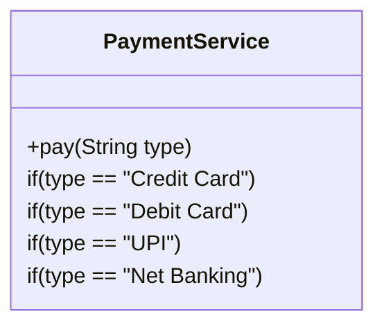
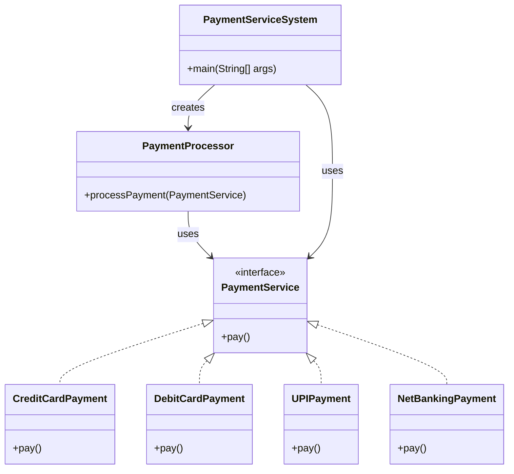

### Before OCP

```mermaid
classDiagram

class PaymentService{
    +pay(String type)
}

PaymentService : if(type == "Credit Card")
PaymentService : if(type == "Debit Card")
PaymentService : if(type == "UPI")
PaymentService : if(type == "Net Banking")
```
### After OCP

```mermaid
classDiagram

class PaymentService{
    <<interface>>
    +pay()
}

class CreditCardPayment{
    +pay()
}

class DebitCardPayment{
    +pay()
}

class UPIPayment{
    +pay()
}

class NetBankingPayment{
    +pay()
}

class PaymentProcessor{
    +processPayment(PaymentService)
}

class PaymentServiceSystem{
    +main(String[] args)
}

PaymentService <|.. CreditCardPayment
PaymentService <|.. DebitCardPayment
PaymentService <|.. UPIPayment
PaymentService <|.. NetBankingPayment

PaymentProcessor --> PaymentService : uses
PaymentServiceSystem --> PaymentProcessor : creates
PaymentServiceSystem --> PaymentService : uses
```
