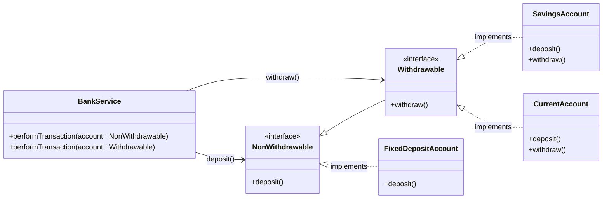

Before LSP
```mermaid
classDiagram

direction LR

class BankAccount {
    <<interface>>
    +deposit()
    +withdraw()
}

class SavingsAccount {
    +deposit()
    +withdraw()
}

class CurrentAccount {
    +deposit()
    +withdraw()
}

class FixedDepositeAccount {
    +deposit()
    +withdraw()
}

class BankService {
    +performTransaction(account : BankAccount)
}

BankAccount <|.. SavingsAccount : implements
BankAccount <|.. CurrentAccount : implements
BankAccount <|.. FixedDepositeAccount : implements

BankService --> BankAccount : uses

note for FixedDepositeAccount
withdraw() throws
UnsupportedOperationException
LSP Violation
end note
```

After LSP

