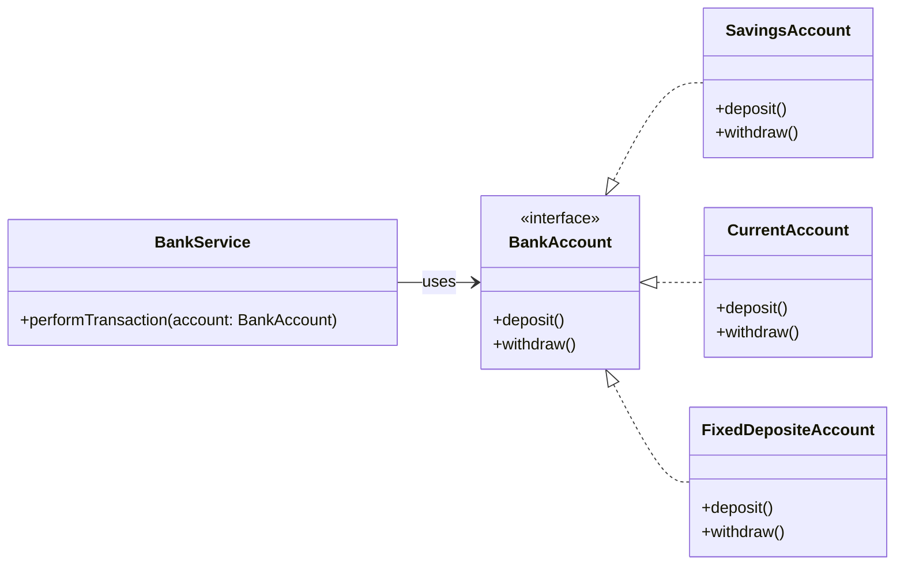
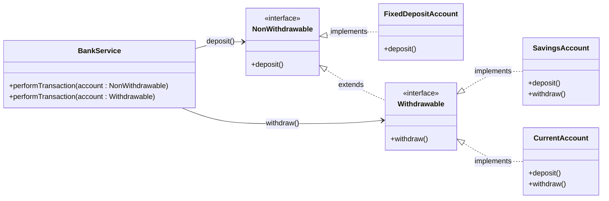

## Before LSP

```mermaid
classDiagram
direction LR

class BankAccount {
    <<interface>>
    +deposit()
    +withdraw()
}

class SavingsAccount {
    +deposit()
    +withdraw()
}

class CurrentAccount {
    +deposit()
    +withdraw()
}

class FixedDepositeAccount {
    +deposit()
    +withdraw()
}

class BankService {
    +performTransaction(account: BankAccount)
}

BankAccount <|.. SavingsAccount
BankAccount <|.. CurrentAccount
BankAccount <|.. FixedDepositeAccount

BankService --> BankAccount : uses
```
## After LSP

```mermaid
classDiagram

direction LR

class NonWithdrawable {
    <<interface>>
    +deposit()
}

class Withdrawable {
    <<interface>>
    +withdraw()
}

class SavingsAccount {
    +deposit()
    +withdraw()
}

class CurrentAccount {
    +deposit()
    +withdraw()
}

class FixedDepositAccount {
    +deposit()
}

class BankService {
    +performTransaction(account : NonWithdrawable)
    +performTransaction(account : Withdrawable)
}


Withdrawable <|.. SavingsAccount : implements
Withdrawable <|.. CurrentAccount : implements
NonWithdrawable <|.. FixedDepositAccount : implements
NonWithdrawable <|.. Withdrawable : extends

BankService --> NonWithdrawable : deposit()
BankService --> Withdrawable : withdraw()
```
