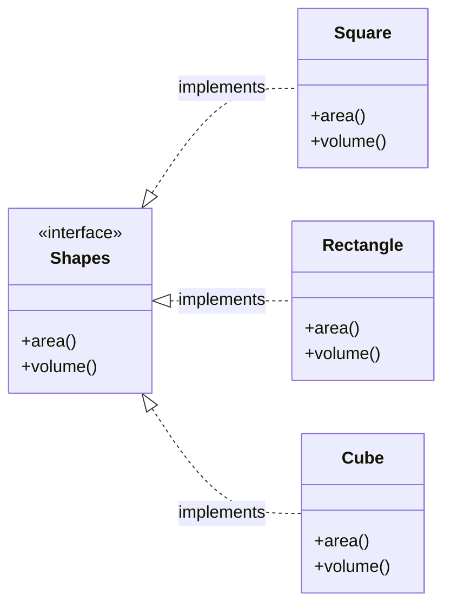
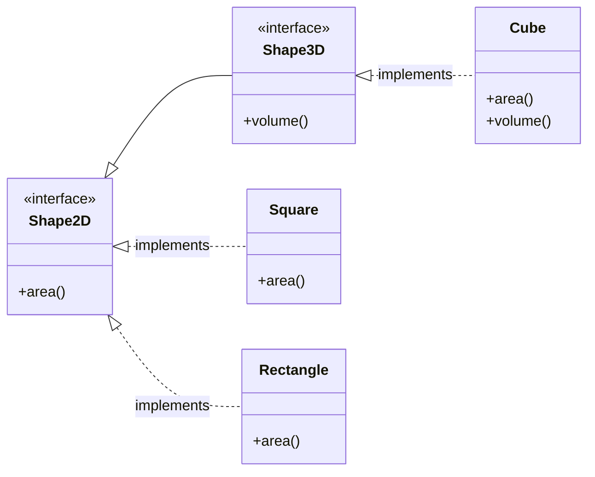

### Before

Explanation :
> **ISP Violation**
>
> - `Shapes` is a **fat interface** because it forces every shape to implement both `area()` and `volume()`.
> - `Square` and `Rectangle` are **2D shapes**, so `volume()` is not applicable.
> - They are forced to throw `UnsupportedOperationException`, which is a violation of the **Interface Segregation Principle (ISP)**.
> - It may also lead to an **LSP violation**, since these classes cannot correctly substitute the `Shapes` interface for all operations.

### After

Explanation:
> **ISP Applied**
>
> - The large `Shapes` interface has been split into two focused interfaces:
>   - `Shape2D` → defines only `area()`
>   - `Shape3D` → extends `Shape2D` and adds `volume()`
> - `Square` and `Rectangle` implement only `Shape2D`, so they are not forced to define an unnecessary `volume()` method.
> - `Cube` implements `Shape3D`, giving it access to both `area()` and `volume()`.
> - This follows the **Interface Segregation Principle (ISP)** because classes now depend only on the methods they actually need.
