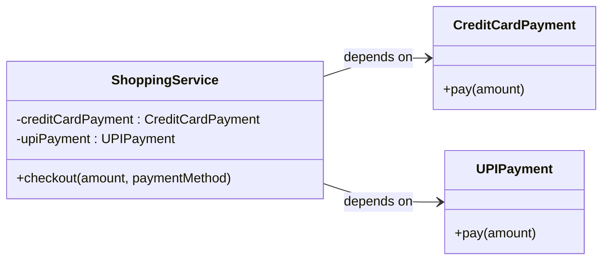
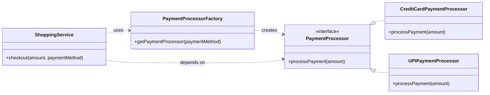

### Before 

```mermaid
classDiagram
direction LR

class CreditCardPayment {
    +pay(amount)
}

class UPIPayment {
    +pay(amount)
}

class ShoppingService {
    -creditCardPayment : CreditCardPayment
    -upiPayment : UPIPayment
    +checkout(amount, paymentMethod)
}

ShoppingService --> CreditCardPayment : depends on
ShoppingService --> UPIPayment : depends on
```
### After

```mermaid
classDiagram
direction LR

class PaymentProcessor {
    <<interface>>
    +processPayment(amount)
}

class CreditCardPaymentProcessor {
    +processPayment(amount)
}

class UPIPaymentProcessor {
    +processPayment(amount)
}

class PaymentProcessorFactory {
    +getPaymentProcessor(paymentMethod)
}

class ShoppingService {
    +checkout(amount, paymentMethod)
}

PaymentProcessor <|.. CreditCardPaymentProcessor
PaymentProcessor <|.. UPIPaymentProcessor

PaymentProcessorFactory ..> PaymentProcessor : creates
ShoppingService ..> PaymentProcessorFactory : uses
ShoppingService ..> PaymentProcessor : depends on
```
