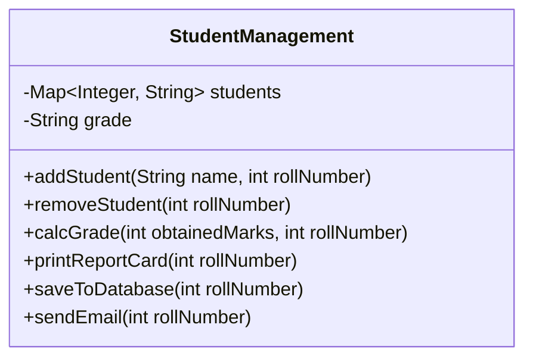
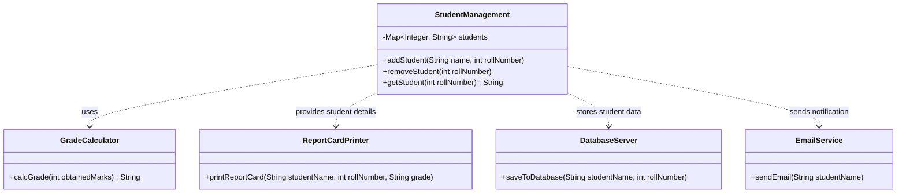

### 1. [UML Diagram for Student Management System](StudentManagementSystem.java)
##### 1(a). Before Applying SRP

```mermaid
classDiagram

class StudentManagement{
    -Map~Integer, String~ students
    -String grade

    +addStudent(String name, int rollNumber)
    +removeStudent(int rollNumber)
    +calcGrade(int obtainedMarks, int rollNumber)
    +printReportCard(int rollNumber)
    +saveToDatabase(int rollNumber)
    +sendEmail(int rollNumber)
}
```
##### 1(b). After Applying SRP

```mermaid
classDiagram

class StudentManagement{
    -Map~Integer, String~ students
    +addStudent(String name, int rollNumber)
    +removeStudent(int rollNumber)
    +getStudent(int rollNumber) String
}

class GradeCalculator{
    +calcGrade(int obtainedMarks) String
}

class ReportCardPrinter{
    +printReportCard(String studentName, int rollNumber, String grade)
}

class DatabaseServer{
    +saveToDatabase(String studentName, int rollNumber)
}

class EmailService{
    +sendEmail(String studentName)
}

StudentManagement ..> GradeCalculator : uses
StudentManagement ..> ReportCardPrinter : provides student details
StudentManagement ..> DatabaseServer : stores student data
StudentManagement ..> EmailService : sends notification
```
